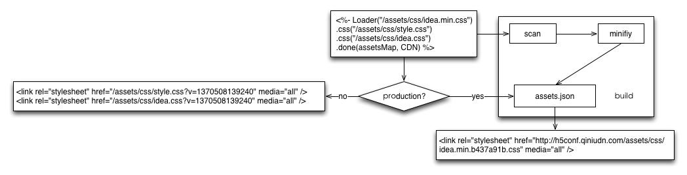

loader [](http://travis-ci.org/JacksonTian/loader) [](https://coveralls.io/r/JacksonTian/loader)
==========================

Node静态资源加载器。该模块通过两个步骤配合完成，代码部分根据环境生成标签。上线时，需要调用minify方法进行静态资源的合并和压缩。

# Usage
## Installation

```bash
$ npm install loader
```

## Example
Controller:

```js
res.render(tpl, {
  Loader: require('loader')
});
```
View:
```html
<%- Loader("/assets/scripts/jqueryplugin.min.js", "/assets/styles/jqueryplugin.min.css")
  .js("/assets/scripts/lib/jquery.jmodal.js")
  .js("/assets/scripts/lib/jquery.mousewheel.min.js")
  .js("/assets/scripts/lib/jquery.tagsphere.min.js")
  .css("/assets/styles/jquery.autocomplate.css")
  .done(assetsMap, prefix, combo) %>
```

### 环境判别
环境判别由`done`方法的第三个参数决定，如果传入combo值，将决定选用线下版本还是线上版本。如果不传入第三个参数，将由环境变量。如下代码实现：

```
process.env.NODE_ENV === 'production'
```
如果不传入combo，需要设置环境，通过以下代码实现：

```
# 生产环境
export NODE_ENV="production"
# 开发环境
export NODE_ENV="dev"
```
可切换进`example`目录运行示例代码：

```
$ npm start
```

### 线上输出
线上模式将会输出合并和压缩后的地址，该地址从Loader构造参数中得到。

```html
<script src="/assets/scripts/jqueryplugin.min.js?version=version"></script>
<link rel="stylesheet" href="/assets/styles/jqueryplugin.min.css?version=version" media="all" />
```

如果你有CDN地址，可以传入prefix参数，使得可以一键切换到CDN地址上，实现网络加速。以下为结果示例：

```html
<script src="http://cnodejs.qiniudn.com/assets/scripts/jqueryplugin.min.js?version=version"></script>
<link rel="stylesheet" href="http://cnodejs.qiniudn.com/assets/styles/jqueryplugin.min.css?version=version" media="all" />
```

### 线下输出
线下模式输出为原始的文件地址。

```html
<script src="/assets/scripts/lib/jquery.jmodal.js"></script>
<script src="/assets/scripts/lib/jquery.mousewheel.min.js"></script>
<script src="/assets/scripts/lib/jquery.tagsphere.min.js"></script>
<link rel="stylesheet" href="/assets/styles/jquery.autocomplate.css" media="all" />
```

## 流程


## API
请参见[API文档](http://html5ify.com/loader/api.html)。

## LESS支持
Loader中支持less文件与普通的CSS文件没有差别，通过`.css()`加载即可。

```
<%- Loader("/assets/styles/jqueryplugin.min.css")
  .css("/assets/styles/jquery.autocomplate.css")
  .css("/assets/styles/bootstrap.less")
  .done(assetsMap, prefix, combo) %>
```

默认情况下会输出less的原始文件，需要借助`Loader.less(root)`中间来拦截`.less`文件的请求，它将自动将其转换为CSS内容。示例如下：

```
app.use(Loader.less(__dirname)); // Loader.less一定要在静态文件中间件之前，否则.less文件会被静态文件中间件所处理
app.use('/assets', connect.static(__dirname + '/assets', { maxAge: 3600000 * 24 * 365 }));
```

在扫描静态文件、合并压缩方面，没有任何改动。

## Stylus支持
基本同LESS。Loader中支持styl文件与普通的CSS文件没有差别，通过`.css()`加载即可。

```
<%- Loader("/assets/styles/jqueryplugin.min.css")
  .css("/assets/styles/jquery.autocomplate.css")
  .css("/assets/styles/bootstrap.styl")
  .done(assetsMap, prefix, combo) %>
```

默认情况下会输出styl的原始文件，需要借助`Loader.stylus(root)`中间来拦截`.styl`文件的请求，它将自动将其转换为CSS内容。示例如下：

```
app.use(Loader.stylus(__dirname)); // Loader.stylus一定要在静态文件中间件之前，否则.styl文件会被静态文件中间件所处理
app.use('/assets', connect.static(__dirname + '/assets', { maxAge: 3600000 * 24 * 365 }));
```

在扫描静态文件、合并压缩方面，没有任何改动。

# License
[MIT license](https://github.com/JacksonTian/loader/blob/master/MIT-License)
